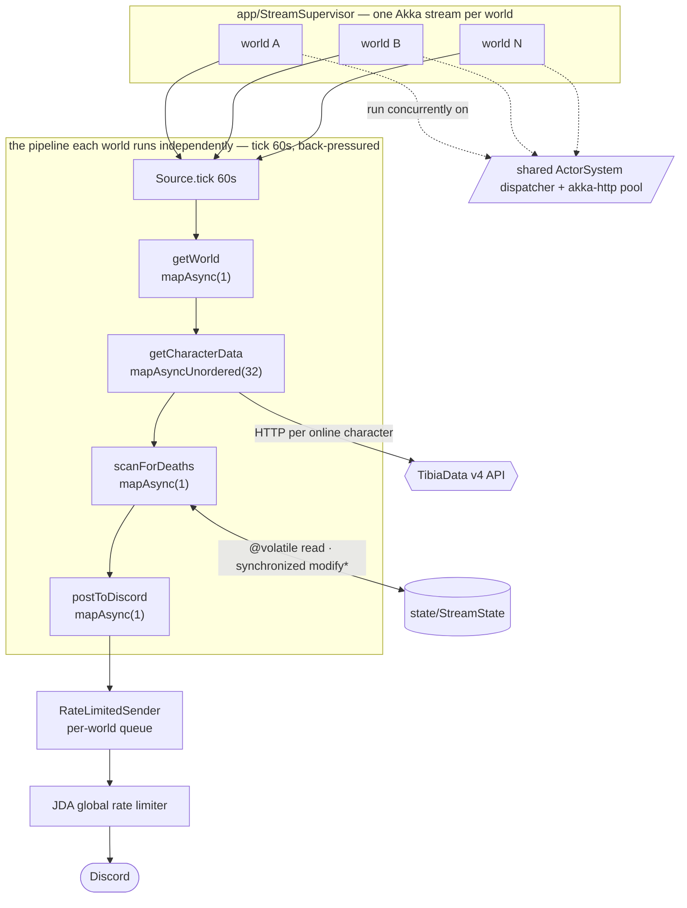

# Violent Bot
This branch is intended for hosting dedicated instances of Violent Bot.    
You can run this locally `free/m` or on a vps for `vps hosting cost/m`

# Patreon
Join Patreon as a **paid supporter** and I will send you an invite link for the bot I am running myself.    
This is the best option if you are non-technical and simply wish to use Violent Bot.

Production:
- [Website](https://violentbot.xyz)
- [Discord](https://discord.gg/PNnzzs4hN3)
- [Patreon](https://www.patreon.com/violentbot)

Current features include:    
- Online List
- Levels List
- Deaths List
- Activity Feed
- Server Save Notifications
- Command Log

## Architecture

The code is organised into focused packages under `com.tibiabot` rather than a few
god-objects. The top-level entry points stay thin:

- `BotApp` — application state and orchestration (wires the collaborators below).
- `BotListener` — a thin JDA event dispatcher; routes each event to a handler.
- `TibiaBot` — the per-world Akka stream that polls TibiaData and detects deaths/levels.

Supporting packages:

| Package | Responsibility |
| --- | --- |
| `app/` | Startup wiring — `Bootstrap` (JDA session) and `StreamSupervisor` (per-world stream lifecycle). |
| `commands/` | Slash-command schemas, `CommandRouter`, `Permissions`; `commands/handlers/` has one object per command. |
| `interactions/` | Button, modal and message (screenshot-upload) interaction handlers. |
| `discord/` | `DiscordGateway` (the JDA read seam) and `RateLimitedSender` (outbound message queue). |
| `persistence/` | Repository ports + `ConnectionProvider`/`SchemaInitializer`; JDBC/Postgres impls in `persistence/jdbc/`. All JDBC access goes through `JdbcSupport.withConnection`, which releases the connection even when a statement throws, so errors can't leak connections under concurrent load. |
| `presentation/` | Pure embed/message builders (deaths, online list, boosted, galthen). |
| `scheduler/` | Server-save schedule decisions (window, Rashid location, Drome countdown). |
| `tracking/` | Death/level/online dedup state and masslog detection. |
| `tibiadata/` | TibiaData v4 API client; response models in `tibiadata/response/`. |
| `wiki/` | Fandom wiki client and HTML parser. |
| `domain/` | Core case classes; game-time cycles in `domain/time/`. |
| `galthen/`, `boosted/`, `admin/` | Feature services extracted from `BotApp`. |

**Concurrency:** one independent Akka stream per world (held by `StreamSupervisor`),
all sharing a single `ActorSystem`/dispatcher and HTTP pool. Each world ticks every
60s through a back-pressured `mapAsync(1)` pipeline with a `mapAsyncUnordered(32)`
fan-out for per-character lookups, and per-stage `Supervision.Resume` so a single bad
response never kills the stream. Per-world dedup state is isolated to each stream; the
state shared across worlds (`state/StreamState`) is read lock-free on `@volatile` fields
and mutated only through synchronized `modify*` helpers, so concurrent per-guild updates
never clobber each other.



The N world streams run concurrently on the shared dispatcher and HTTP pool; the only
points they contend on are `StreamState` (serialised writes) and the JDA rate limiter
(outbound sends). Startup staggers stream launches by ~5.5s so they don't all poll at once.

## Building & Testing

The project targets Java 8 and builds with sbt. If you don't have a JDK 8 / sbt
toolchain locally, build and test in Docker:

```bash
docker run --rm -u "$(id -u):$(id -g)" -e HOME=/cache \
  -v "$HOME/.cache/tibiabot-build:/cache" -v "$PWD:/work" -w /work/tibia-bot \
  sbtscala/scala-sbt:eclipse-temurin-8u352-b08_1.8.2_2.13.10 sbt -batch test
```

Tests are hermetic by default:

- **Unit tests** cover the pure logic (routing, permissions, embed builders, trackers,
  schedule decisions, the rate-limited sender).
- **Decoder tests** parse frozen real TibiaData `/v4` responses
  (`src/test/resources/tibiadata/`) with the production JSON formats, locking the API contract.
- **Postgres integration tests** self-cancel unless a database is provided; to run them,
  add `--network <pg-net> -e PGHOST=<host> -e PGPASSWORD=<pw>` to the command above.

## Pre-requisites:

#### Create the new bot in Discord
1. Go to: https://discord.com/developers/applications and create a **New Application**.
2. Go to the **Bot** tab and click on **Add Bot**.
3. Click **Reset Token** & take note of the `Token` that is generated.

#### Custom Emojis and Poke Roles
The bot is configured to point to emojis in _my_ discord server.     
You will need to change this to point to your emojis.

1. Upload the emojis provided in the [discord emojis](https://github.com/Leo32onGIT/tibia-bot/tree/dedicated/tibia-bot/src/main/resources/discord%20emojis) folder to your discord.
2. Open the [discord.conf](https://github.com/Leo32onGIT/tibia-bot/blob/dedicated/tibia-bot/src/main/resources/discord.conf#L17-L60) file and edit it.
3. Point to `emoji ids` to ones that exist on _your_ discord server - the ones you uploaded in step 1.

#### Prepare your machine to host the bot
1. Ensure `docker` (with the **Compose** plugin) is installed.
2. Ensure you can build the bot image — either `sbt` + `Java JDK 8` locally, or use
   the dockerized build shown below.

Redis and (optionally) Postgres are provided by `docker-compose.yml`, so you no
longer need to pull or run them by hand.

## Running with Docker Compose

The repository ships a `docker-compose.yml` that runs the bot together with a
Redis cache and, optionally, a bundled Postgres.

1. **Build the bot image** (tags `violent-bot-dedicated:latest`):

   ```bash
   sbt docker:publishLocal
   ```

   No local sbt? Stage the image with the dockerized build, then `docker build`:

   ```bash
   docker run --rm -u "$(id -u):$(id -g)" -e HOME=/cache \
     -v "$HOME/.cache/tibiabot-build:/cache" -v "$PWD:/work" -w /work/tibia-bot \
     sbtscala/scala-sbt:eclipse-temurin-8u352-b08_1.8.2_2.13.10 sbt -batch docker:stage
   docker build -t violent-bot-dedicated:latest tibia-bot/target/docker/stage
   ```

2. **Create your `.env`** from the template and fill it in:

   ```bash
   cp .env.example .env
   ```

3. **Start the stack** — pick the database mode:

   - **Bundled Postgres** (self-contained — keep `POSTGRES_HOST=postgres` in `.env`):

     ```bash
     docker compose --profile local-db up -d
     ```

   - **Pre-existing / external Postgres** (set `POSTGRES_HOST` to your server in
     `.env`, no profile):

     ```bash
     docker compose up -d
     ```

Redis starts in both modes. To run **without** caching, set `REDIS_HOST=` (empty)
in `.env`; the bot then ignores the redis container.

### Connecting to a pre-existing Postgres

Leave the `local-db` profile off and point `POSTGRES_HOST` at your database host
or IP. The bot connects as the `postgres` user with `POSTGRES_PASSWORD` and creates
its own databases on first run. It always uses **port 5432**, so your database must
listen there.

> With the bundled Postgres, the bot may log a few connection errors and restart
> while Postgres initialises on first boot — this is expected and self-resolves.

### Manual (without Compose)

The original `docker run` flow still works: create a `violentbot` network, run a
`postgres` container, a `redis:7-alpine` container (with `--appendonly yes`), and
the `violent-bot-dedicated` image, each with `--env-file .env`. The
`docker-compose.yml` is the source of truth for the exact images and settings.

## Debugging

1. Tail the bot logs: `docker compose logs -f bot` (errors are usually self-explanatory).
2. See what's running: `docker compose ps`.
3. **Pool sizing:** grep the bot logs for `[req-probe]` — every 60s it logs per-host
   latency percentiles, req/sec and a suggested `max-connections` you can feed back
   into `akka.conf`'s `per-host-override`.
4. To visualise the databases, run pgAdmin on the compose network:
   `docker run -t --name pgadmin -p 82:80 --network <compose-network> -e 'PGADMIN_DEFAULT_EMAIL=you@example.com' -e 'PGADMIN_DEFAULT_PASSWORD=changeme' -d dpage/pgadmin4`
   (find `<compose-network>` with `docker network ls`).
