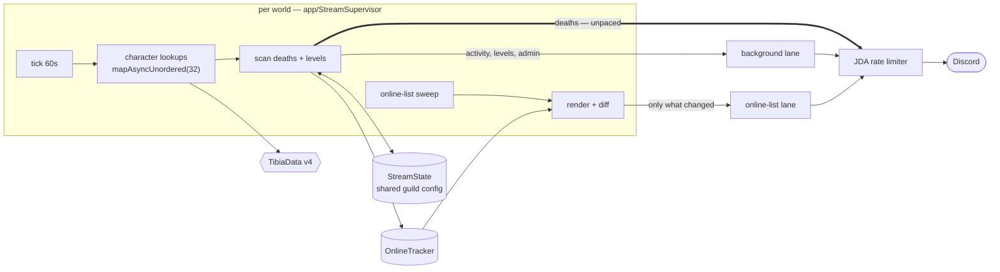

# Violent Bot
This branch is intended for hosting dedicated instances of Violent Bot.    
You can run this locally `free/m` or on a vps for `vps hosting cost/m`

## License
Licensed under the [PolyForm Noncommercial License 1.0.0](LICENSE). You're free to
view, run, and modify this code for noncommercial purposes. Commercial use — including
running a paid or monetized service based on this code — requires a separate agreement;
reach out via the links below.

# Patreon
Join Patreon as a **paid supporter** and I will send you an invite link for the bot I am running myself.    
This is the best option if you are non-technical and simply wish to use Violent Bot.

Production:
- [Website](https://violentbot.xyz)
- [Discord](https://discord.gg/PNnzzs4hN3)
- [Patreon](https://www.patreon.com/violentbot)

Current features include:    
- Online List
- Levels List
- Deaths List
- Activity Feed
- Server Save Notifications
- Command Log
- Respawn Claim System

## Architecture

One Pekko stream per Tibia world polls TibiaData every 60s and posts deaths and
level-ups to Discord. A second sweep per world rebuilds the online lists on its
own cadence, off that critical path. Every world shares one `ActorSystem`, HTTP
pool, Postgres and (optional) Redis.


```mermaid
flowchart LR
    subgraph W ["per world — app/StreamSupervisor"]
        direction TB
        T["tick 60s"] --> GC["character lookups<br/>mapAsyncUnordered(32)"]
        GC --> SD["scan deaths + levels"]
        SW["online-list sweep"] --> OL["render + diff"]
    end
    GC --> API{{"TibiaData v4"}}
    SD <--> ST[("StreamState<br/>shared guild config")]
    SD --> OT[("OnlineTracker")]
    OT --> OL
    SD ==>|"deaths — unpaced"| JDA["JDA rate limiter"]
    SD -->|"activity, levels, admin"| BG["background lane"]
    OL -->|"only what changed"| OLQ["online-list lane"]
    BG --> JDA
    OLQ --> JDA
    JDA --> D([Discord])
```

Three rules explain most of the design:

- **Deaths come first.** They skip both outbound queues and go straight to JDA.
  Everything else is paced in two bot-wide lanes — a general one, and a much
  slower one for online-list edits, which Discord rate-limits per channel.
- **Nothing shared blocks a stream.** Per-world dedup state is private to its
  stream; the cross-world `StreamState` is read lock-free and written under a lock.
- **A bad response never kills a world.** Every stage runs `Supervision.Resume`.

### Packages

Entry points stay thin: `BotApp` wires everything, `BotListener` dispatches JDA
events, `TibiaBot` is the per-world stream.

| Package | Responsibility |
| --- | --- |
| `app/` | Startup wiring and per-world stream lifecycle. |
| `commands/` | Slash-command schemas, router, permissions; one handler per command. |
| `interactions/` | Button, modal and screenshot-upload handlers. |
| `discord/` | JDA read seam and the rate-limited outbound sender. |
| `persistence/` | Repository ports; JDBC/Postgres impls in `persistence/jdbc/`. |
| `presentation/` | Pure embed and message builders. |
| `scheduler/` | Server-save schedule decisions. |
| `state/`, `tracking/` | Config shared across worlds; per-world dedup and caches. |
| `notifications/` | Mass-log and login DM subscriptions. |
| `tibiadata/`, `wiki/` | TibiaData v4 client with caching and retries; Fandom wiki client. |
| `paywall/`, `patreonapi/` | Patreon seats — a (guild, world) pair tied to a subscription. |
| `web/` | Dashboards behind Discord OAuth, log capture, Patreon admin routes. |
| `domain/` | Core case classes; game-time cycles in `domain/time/`. |
| `respawn/` | Respawn claim system. `RESPAWN_ENABLED=false` withdraws it. |
| `highscores/` | Level advances and experience history. `HIGHSCORES_ENABLED=false` stops both. |
| `setup/`, `worldsettings/`, `hunted/`, `customsort/`, `galthen/`, `boosted/`, `admin/` | Feature services. |

## Deployment

You need docker with the Compose plugin, plus sbt and a JDK 25 to build the image.

1. **Create the bot.** At [discord.com/developers](https://discord.com/developers/applications):
   New Application → Bot → Reset Token, and keep the token.

2. **Point the emojis at your server.** The bot ships with emoji IDs from *my*
   Discord. Upload [these emojis](tibia-bot/src/main/resources/discord%20emojis)
   to yours and replace the IDs in
   [discord.conf](tibia-bot/src/main/resources/discord.conf#L38-L81).

3. **Fill in the environment.** `.env.example` documents every variable and what
   changes when you leave one out:

   ```bash
   cp .env.example .env
   ```

4. **Create the shared network** (one-off, so unmanaged containers can join it):

   ```bash
   docker network create violentbot
   ```

5. **Build and start:**

   ```bash
   sbt Docker/publishLocal && docker compose up -d
   ```

Which services come up is driven by `COMPOSE_PROFILES` in `.env`:

| Profile | Adds | When you want it |
|---|---|---|
| `local-db` | bundled Postgres | No database of your own. Omit it and point `POSTGRES_HOST` at an existing one on 5432. |
| `local-cache` | bundled Redis | Caching on this host. A secondary leaves it off and points `REDIS_HOST` at the primary. |
| `own-dashboard` | Caddy, automatic HTTPS | This host serves the dashboard. Needs `STATUS_DOMAIN` pointed here and ports 80/443 open. |

**To update**, rebuild and repeat step 5 — Compose recreates only the bot, leaving
the database and Redis running:

```bash
git pull && sbt Docker/publishLocal && docker compose up -d
```

**To check on it:** `docker compose ps`, and `docker compose logs -f bot`.
