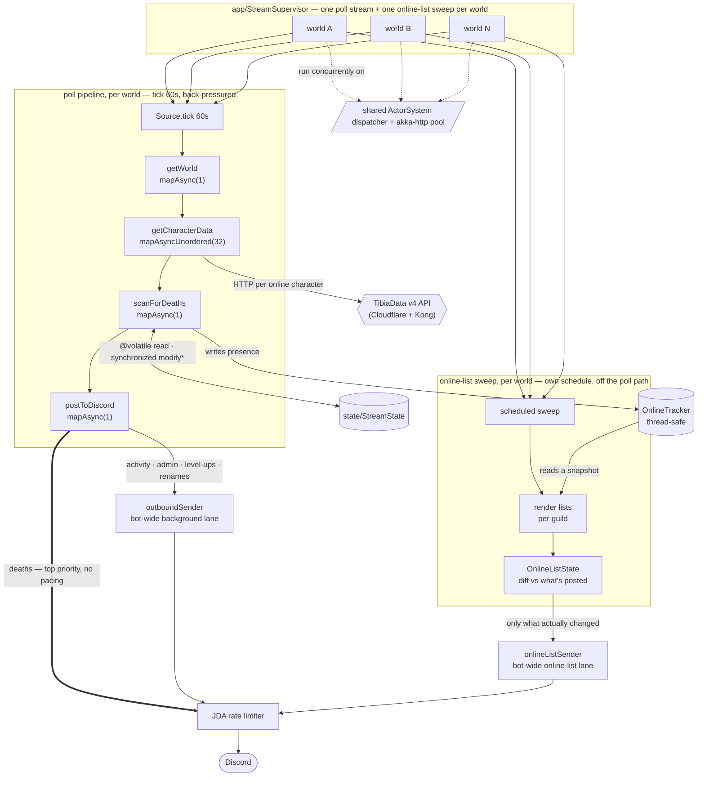

# Violent Bot
This branch is intended for hosting dedicated instances of Violent Bot.    
You can run this locally `free/m` or on a vps for `vps hosting cost/m`

## License
Licensed under the [PolyForm Noncommercial License 1.0.0](LICENSE). You're free to
view, run, and modify this code for noncommercial purposes. Commercial use — including
running a paid or monetized service based on this code — requires a separate agreement;
reach out via the links below.

# Patreon
Join Patreon as a **paid supporter** and I will send you an invite link for the bot I am running myself.    
This is the best option if you are non-technical and simply wish to use Violent Bot.

Production:
- [Website](https://violentbot.xyz)
- [Discord](https://discord.gg/PNnzzs4hN3)
- [Patreon](https://www.patreon.com/violentbot)

Current features include:    
- Online List
- Levels List
- Deaths List
- Activity Feed
- Server Save Notifications
- Command Log
- Respawn Claim System

## Architecture

The code is organised into focused packages under `com.tibiabot` rather than a few
god-objects. The top-level entry points stay thin:

- `BotApp` — application state and orchestration (wires the collaborators below).
- `BotListener` — a thin JDA event dispatcher; routes each event to a handler.
- `TibiaBot` — the per-world Akka stream that polls TibiaData and detects deaths/levels.

Supporting packages:

| Package | Responsibility |
| --- | --- |
| `app/` | Startup wiring — `Bootstrap` (JDA session) and `StreamSupervisor` (per-world stream lifecycle). |
| `commands/` | Slash-command schemas, `CommandRouter`, `Permissions`; `commands/handlers/` has one object per command. |
| `interactions/` | Button, modal and message (screenshot-upload) interaction handlers. |
| `discord/` | `DiscordGateway` (the JDA read seam) and `RateLimitedSender` (outbound message queue). |
| `persistence/` | Repository ports + `ConnectionProvider`/`SchemaInitializer`; JDBC/Postgres impls in `persistence/jdbc/`. All JDBC access goes through `JdbcSupport.withConnection`, which releases the connection even when a statement throws, so errors can't leak connections under concurrent load. |
| `presentation/` | Pure embed/message builders (deaths, online list, boosted, galthen). |
| `scheduler/` | Server-save schedule decisions (window, Rashid location, Drome countdown). |
| `state/` | `StreamState` — the per-guild hunted/allied/world config shared by every stream. |
| `tracking/` | Per-world stream state: death/level/online dedup, masslog detection, the online-list message cache, killer-level cache, and the dashboard's metrics/recent-event buffers. |
| `tibiadata/` | TibiaData v4 API client, its caching decorator, and `RetryPolicy`; response models in `tibiadata/response/`. |
| `paywall/` | Patreon seat system — ties a (guild, world) pair's activity to a supporter's subscription. |
| `web/` | The monitoring dashboard: Discord-OAuth-gated `/status`, log capture, Patreon admin routes. |
| `wiki/` | Fandom wiki client and HTML parser. |
| `domain/` | Core case classes; game-time cycles in `domain/time/`. |
| `respawn/` | Respawn claim system: catalogue + seed loader, the claim/queue/stamina rules, and the forum-thread lifecycle. Gated behind `RESPAWN_ENABLED`. |
| `setup/`, `worldsettings/`, `hunted/`, `customsort/`, `galthen/`, `boosted/`, `admin/`, `patreonapi/` | Feature services extracted from `BotApp`. |

**Concurrency:** one independent Akka stream per world (held by `StreamSupervisor`),
all sharing a single `ActorSystem`/dispatcher and HTTP pool. Each world ticks every
60s through a back-pressured `mapAsync(1)` pipeline with a `mapAsyncUnordered(32)`
fan-out for per-character lookups, and per-stage `Supervision.Resume` so a single bad
response never kills the stream.

Alongside each stream, a **separate scheduled sweep refreshes that world's online
lists**. Rebuilding a list means sorting and rendering every online player for every
Discord tracking the world, so doing it inside the poll pipeline put it on the critical
path for that tick's deaths. It now runs on its own cadence and reads a thread-safe
snapshot of the tracker, which means a slow or failing poll neither delays the online
list nor is delayed by it.

Per-world dedup state is isolated to each stream. State shared across worlds
(`state/StreamState`) is read lock-free on `@volatile` fields and mutated through
synchronized `modify*` helpers, so concurrent per-guild updates never clobber each
other — except the character freshness cache, which is written once per character
response (tens of thousands a minute) and so is a `ConcurrentHashMap` with per-entry
striping rather than a copy-on-write map behind the shared lock.


```mermaid
flowchart TB
    subgraph sup ["app/StreamSupervisor — one poll stream + one online-list sweep per world"]
        WA[world A]
        WB[world B]
        WN[world N]
    end

    subgraph pipe ["poll pipeline, per world — tick 60s, back-pressured"]
        direction LR
        T["Source.tick 60s"] --> GWp["getWorld<br/>mapAsync(1)"]
        GWp --> GC["getCharacterData<br/>mapAsyncUnordered(32)"]
        GC --> SDp["scanForDeaths<br/>mapAsync(1)"]
        SDp --> PDp["postToDiscord<br/>mapAsync(1)"]
    end

    subgraph sweep ["online-list sweep, per world — own schedule, off the poll path"]
        direction LR
        SW["scheduled sweep"] --> OL["render lists<br/>per guild"]
        OL --> OLS["OnlineListState<br/>diff vs what's posted"]
    end

    WA --> T
    WB --> T
    WN --> T
    WA --> SW
    WB --> SW
    WN --> SW

    GC -->|HTTP per online character| API{{"TibiaData v4 API<br/>(Cloudflare + Kong)"}}
    SDp <-->|"@volatile read · synchronized modify*"| ST[("state/StreamState")]
    SDp -->|"writes presence"| OT[("OnlineTracker<br/>thread-safe")]
    OT -->|"reads a snapshot"| OL

    PDp ==>|"deaths — top priority, no pacing"| JDA
    PDp -->|"activity · admin · level-ups · renames"| BG["outboundSender<br/>bot-wide background lane"]
    OLS -->|"only what actually changed"| OLQ["onlineListSender<br/>bot-wide online-list lane"]
    BG --> JDA["JDA rate limiter"]
    OLQ --> JDA
    JDA --> D([Discord])

    WA -.->|run concurrently on| AS[/"shared ActorSystem dispatcher + akka-http pool"/]
    WB -.-> AS
    WN -.-> AS
```

The world streams run concurrently on the shared dispatcher and HTTP pool; the only
points they contend on are `StreamState` (serialised writes) and the outbound lanes.
Startup staggers stream launches by ~5.5s so they don't all poll at once.

**Outbound traffic is split by priority, not by world.** Both `RateLimitedSender`
lanes are bot-wide singletons, so the aggregate send rate is bounded across every
world rather than per stream. Deaths — the thing the bot exists to post quickly —
bypass both lanes and go straight to JDA's own rate limiter. Everything else is
paced: low-priority notifications share the background lane, and online-list edits
get their own much slower lane, because Discord rate-limits message-edit calls far
harder than the general REST budget. Each queued item is keyed by its target, so a
backlog is bounded by the number of distinct channels/messages rather than by how
often they are refreshed — a superseded update is replaced, not queued behind its
own successor.

Those edit limits are per-channel while the lane's pace is bot-wide, so online-list
items also carry their channel as a *group*: the drain skips past an item whose
channel it touched within the last `online-list-per-channel-min-gap-ms` and spends
the slot on a different channel instead. Without it, a list that packs into several
embeds enqueues them together and drains back-to-back, putting enough edits into one
channel to trip that channel's limit even while the bot-wide rate is well within
budget. Skipping costs no throughput — only ordering.

## Local TibiaData Api (Optional)
This is only used for the Boosted boss/creature endpoints — everything else, including the per-character death polling,
goes to the public `api.tibiadata.com`.    
Using a local instance of TibiaData gives you quicker server save notifications.

> ⚠️ A local instance scrapes tibia.com directly and tolerates **far** less traffic
> than the public API before Cloudflare blocks it for an hour. Keep it on the
> low-volume endpoints above; do not point the character polling at it.

1. Edit the `.env` file
```env
TIBIADATA_HOST=http://tibiadata-api:8081
```
2. Run it on the same docker network so violent bot can access it:

```bash
docker run -d -p XXXXXXXX:8081:8080 --name tibiadata-api --network violentbot --rm -it ghcr.io/tibiadata/tibiadata-api-go:latest
```

## Pre-requisites:

#### Create the new bot in Discord
1. Go to: https://discord.com/developers/applications and create a **New Application**.
2. Go to the **Bot** tab and click on **Add Bot**.
3. Click **Reset Token** & take note of the `Token` that is generated.

#### Custom Emojis
The bot is configured to point to emojis in _my_ discord server.     
You will need to change this to point to your emojis.

1. Upload the emojis provided in the [discord emojis](https://github.com/Leo32onGIT/tibia-bot/tree/main/tibia-bot/src/main/resources/discord%20emojis) folder to your discord.
2. Open the [discord.conf](https://github.com/Leo32onGIT/tibia-bot/blob/main/tibia-bot/src/main/resources/discord.conf#L38-L81) file and edit it.
3. Point to `emoji ids` to ones that exist on _your_ discord server - the ones you uploaded in step 1.

#### Prepare your machine to host the bot
1. Ensure `docker` (with the **Compose** plugin) is installed.
2. Ensure you can build the bot image — either `sbt` + `Java JDK 8` locally

## Deployment Steps   
**Config and start the Postgres database first:**    

1. Create a `.env` file and fill out it out:    

   ```env
   TOKEN=XXXXXXXXXXXXXXXXXXXXXX
   POSTGRES_HOST=sqlhost
   POSTGRES_USER=postgres
   POSTGRES_PASSWORD=XXXXXXXXXX
   TIBIADATA_HOST=https://api.tibiadata.com/
   REDIS_HOST=redis
   REDIS_PORT=6379
   REDIS_PASSWORD=XXXXXXXXXXXX
   ```
2. Create the docker volume for the postgres database:    

   ```bash
   docker volume create --name pgdata
   ```
3. Create the docker network for the `postgres database` and `violent bot` to communicate over:    

   ```bash
   docker network create violentbot
   ```
4. Run the postgres docker image:    

   ```bash
   docker run --rm -d -t --env-file .env --hostname sqlhost --network=violentbot --name postgres -p 5432:5432 -v pgdata:/var/lib/postgresql postgres
   ```

The repository ships a `docker-compose.yml` that runs the bot together with a
Redis cache.

5. **Build the bot image** (tags `violent-bot-dedicated:latest`):    

   ```bash
   sbt docker:publishLocal
   ```
   <details><summary>⚠️ No local sbt?</summary>Stage the image with the dockerized build, then `docker build`:    

   ```bash
   docker run --rm -u "$(id -u):$(id -g)" -e HOME=/cache \
   -v "$HOME/.cache/tibiabot-build:/cache" -v "$PWD:/work" -w /work/tibia-bot \
   sbtscala/scala-sbt:eclipse-temurin-8u352-b08_1.8.2_2.13.10 sbt -batch docker:stage
   docker build -t violent-bot-dedicated:latest tibia-bot/target/docker/stage
   ```
   </details>

6. **Start the stack**:    

     ```bash
     docker compose up -d
     ```

To run **without** caching, unset `REDIS_HOST=` in `.env`.

## Building & Testing

The project targets Java 8 and builds with sbt. If you don't have a JDK 8 / sbt
toolchain locally, build and test in Docker:

```bash
docker run --rm -u "$(id -u):$(id -g)" -e HOME=/cache \
-v "$HOME/.cache/tibiabot-build:/cache" -v "$PWD:/work" -w /work/tibia-bot \
sbtscala/scala-sbt:eclipse-temurin-8u352-b08_1.8.2_2.13.10 sbt -batch test
```

## Debugging

1. Tail the bot logs: `docker compose logs -f bot` (errors are usually self-explanatory).
2. See what's running: `docker compose ps`.
3. To visualise the databases, run pgAdmin on the compose network:
   ```bash
   docker run -t --name pgadmin -p 82:80 --network violentbot -e 'PGADMIN_DEFAULT_EMAIL=you@example.com' -e 'PGADMIN_DEFAULT_PASSWORD=changeme' -d dpage/pgadmin4
   ```
