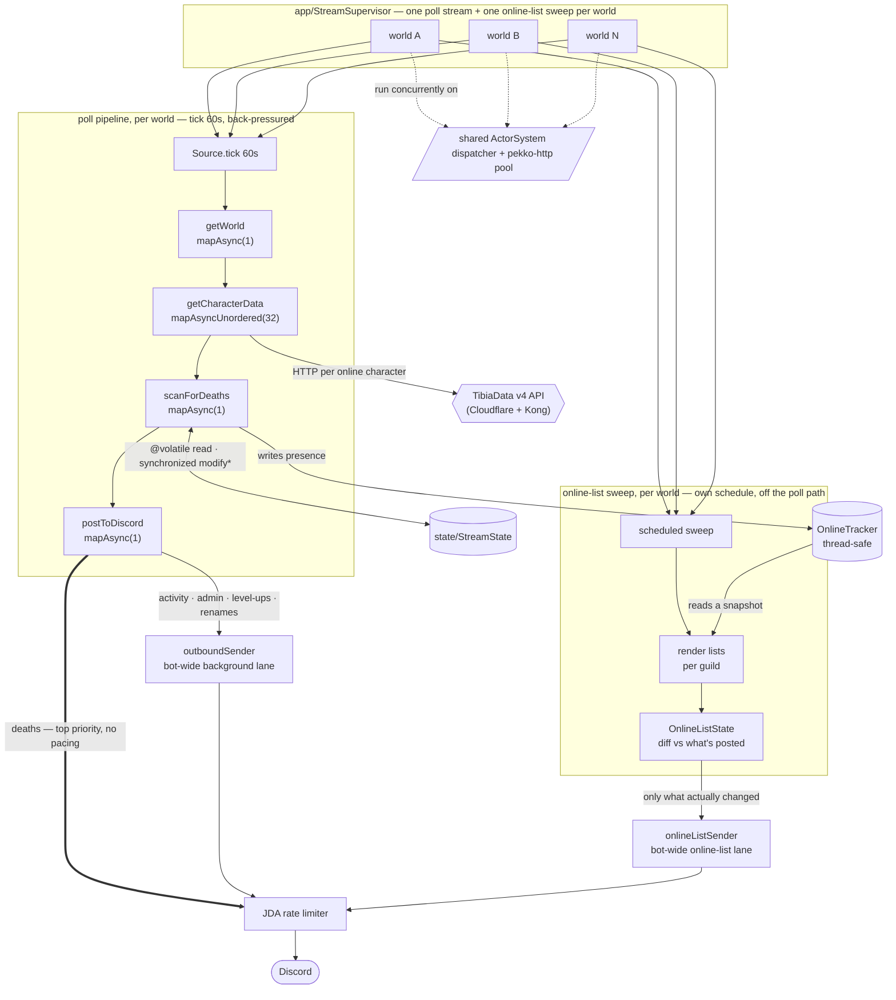

# Violent Bot
This branch is intended for hosting dedicated instances of Violent Bot.    
You can run this locally `free/m` or on a vps for `vps hosting cost/m`

## License
Licensed under the [PolyForm Noncommercial License 1.0.0](LICENSE). You're free to
view, run, and modify this code for noncommercial purposes. Commercial use — including
running a paid or monetized service based on this code — requires a separate agreement;
reach out via the links below.

# Patreon
Join Patreon as a **paid supporter** and I will send you an invite link for the bot I am running myself.    
This is the best option if you are non-technical and simply wish to use Violent Bot.

Production:
- [Website](https://violentbot.xyz)
- [Discord](https://discord.gg/PNnzzs4hN3)
- [Patreon](https://www.patreon.com/violentbot)

Current features include:    
- Online List
- Levels List
- Deaths List
- Activity Feed
- Server Save Notifications
- Command Log
- Respawn Claim System

## Architecture

The code is organised into focused packages under `com.tibiabot` rather than a few
god-objects. The top-level entry points stay thin:

- `BotApp` — application state and orchestration (wires the collaborators below).
- `BotListener` — a thin JDA event dispatcher; routes each event to a handler.
- `TibiaBot` — the per-world Pekko stream that polls TibiaData and detects deaths/levels.

Supporting packages:

| Package | Responsibility |
| --- | --- |
| `app/` | Startup wiring — `Bootstrap` (JDA session) and `StreamSupervisor` (per-world stream lifecycle). |
| `commands/` | Slash-command schemas, `CommandRouter`, `Permissions`; `commands/handlers/` has one object per command. |
| `interactions/` | Button, modal and message (screenshot-upload) interaction handlers. |
| `discord/` | `DiscordGateway` (the JDA read seam) and `RateLimitedSender` (outbound message queue). |
| `persistence/` | Repository ports + `ConnectionProvider`/`SchemaInitializer`; JDBC/Postgres impls in `persistence/jdbc/`. All JDBC access goes through `JdbcSupport.withConnection`, which releases the connection even when a statement throws, so errors can't leak connections under concurrent load. |
| `presentation/` | Pure embed/message builders (deaths, online list, boosted, galthen). |
| `scheduler/` | Server-save schedule decisions (window, Rashid location, Drome countdown). |
| `state/` | `StreamState` — the per-guild hunted/allied/world config shared by every stream. |
| `tracking/` | Per-world stream state: death/level/online dedup, masslog detection, bounty login presence, the online-list message cache, killer-level cache, and the dashboard's metrics/recent-event buffers. |
| `notifications/` | The two DM subscriptions behind the notification-channel autoroles — mass-log alerts at a threshold you pick, and login alerts for characters you're watching. |
| `tibiadata/` | TibiaData v4 API client, its caching decorator, and `RetryPolicy`; response models in `tibiadata/response/`. |
| `paywall/` | Patreon seat system — ties a (guild, world) pair's activity to a supporter's subscription. |
| `web/` | The monitoring dashboard: Discord-OAuth-gated `/status`, log capture, Patreon admin routes. |
| `wiki/` | Fandom wiki client and HTML parser. |
| `domain/` | Core case classes; game-time cycles in `domain/time/`. |
| `respawn/` | Respawn claim system: catalogue + seed loader, the claim/queue/stamina rules, and the forum-thread lifecycle. On by default; `RESPAWN_ENABLED=false` withdraws it cleanly. |
| `highscores/` | Skill advances into the Levels channel, and the experience history behind the statistics channel. The primary sweeps the highscore lists at a paced walk and files what advanced; every bot posts from that table for its own guilds. On by default; `HIGHSCORES_ENABLED=false` stops both halves. |
| `setup/`, `worldsettings/`, `hunted/`, `customsort/`, `galthen/`, `boosted/`, `admin/`, `patreonapi/` | Feature services extracted from `BotApp`. |

**Concurrency:** one independent Pekko stream per world (held by `StreamSupervisor`),
all sharing a single `ActorSystem`/dispatcher and HTTP pool. Each world ticks every
60s through a back-pressured `mapAsync(1)` pipeline with a `mapAsyncUnordered(32)`
fan-out for per-character lookups, and per-stage `Supervision.Resume` so a single bad
response never kills the stream.

Alongside each stream, a **separate scheduled sweep refreshes that world's online
lists**. Rebuilding a list means sorting and rendering every online player for every
Discord tracking the world, so doing it inside the poll pipeline put it on the critical
path for that tick's deaths. It now runs on its own cadence and reads a thread-safe
snapshot of the tracker, which means a slow or failing poll neither delays the online
list nor is delayed by it.

Per-world dedup state is isolated to each stream. State shared across worlds
(`state/StreamState`) is read lock-free on `@volatile` fields and mutated through
synchronized `modify*` helpers, so concurrent per-guild updates never clobber each
other — except the character freshness cache, which is written once per character
response (tens of thousands a minute) and so is a `ConcurrentHashMap` with per-entry
striping rather than a copy-on-write map behind the shared lock.


```mermaid
flowchart TB
    subgraph sup ["app/StreamSupervisor — one poll stream + one online-list sweep per world"]
        WA[world A]
        WB[world B]
        WN[world N]
    end

    subgraph pipe ["poll pipeline, per world — tick 60s, back-pressured"]
        direction LR
        T["Source.tick 60s"] --> GWp["getWorld<br/>mapAsync(1)"]
        GWp --> GC["getCharacterData<br/>mapAsyncUnordered(32)"]
        GC --> SDp["scanForDeaths<br/>mapAsync(1)"]
        SDp --> PDp["postToDiscord<br/>mapAsync(1)"]
    end

    subgraph sweep ["online-list sweep, per world — own schedule, off the poll path"]
        direction LR
        SW["scheduled sweep"] --> OL["render lists<br/>per guild"]
        OL --> OLS["OnlineListState<br/>diff vs what's posted"]
    end

    WA --> T
    WB --> T
    WN --> T
    WA --> SW
    WB --> SW
    WN --> SW

    GC -->|HTTP per online character| API{{"TibiaData v4 API<br/>(Cloudflare + Kong)"}}
    SDp <-->|"@volatile read · synchronized modify*"| ST[("state/StreamState")]
    SDp -->|"writes presence"| OT[("OnlineTracker<br/>thread-safe")]
    OT -->|"reads a snapshot"| OL

    PDp ==>|"deaths — top priority, no pacing"| JDA
    PDp -->|"activity · admin · level-ups · renames"| BG["outboundSender<br/>bot-wide background lane"]
    OLS -->|"only what actually changed"| OLQ["onlineListSender<br/>bot-wide online-list lane"]
    BG --> JDA["JDA rate limiter"]
    OLQ --> JDA
    JDA --> D([Discord])

    WA -.->|run concurrently on| AS[/"shared ActorSystem dispatcher + pekko-http pool"/]
    WB -.-> AS
    WN -.-> AS
```

The world streams run concurrently on the shared dispatcher and HTTP pool; the only
points they contend on are `StreamState` (serialised writes) and the outbound lanes.
Startup staggers stream launches by ~5.5s so they don't all poll at once.

**Outbound traffic is split by priority, not by world.** Both `RateLimitedSender`
lanes are bot-wide singletons, so the aggregate send rate is bounded across every
world rather than per stream. Deaths — the thing the bot exists to post quickly —
bypass both lanes and go straight to JDA's own rate limiter. Everything else is
paced: low-priority notifications share the background lane, and online-list edits
get their own much slower lane, because Discord rate-limits message-edit calls far
harder than the general REST budget. Each queued item is keyed by its target, so a
backlog is bounded by the number of distinct channels/messages rather than by how
often they are refreshed — a superseded update is replaced, not queued behind its
own successor.

Those edit limits are per-channel while the lane's pace is bot-wide, so online-list
items also carry their channel as a *group*: the drain skips past an item whose
channel it touched within the last `online-list-per-channel-min-gap-ms` and spends
the slot on a different channel instead. Without it, a list that packs into several
embeds enqueues them together and drains back-to-back, putting enough edits into one
channel to trip that channel's limit even while the bot-wide rate is well within
budget. Skipping costs no throughput — only ordering.

## Local TibiaData Api (Optional)
This is only used for the Boosted boss/creature endpoints — everything else, including the per-character death polling,
goes to the public `api.tibiadata.com`.    
Using a local instance of TibiaData gives you quicker server save notifications.

> ⚠️ A local instance scrapes tibia.com directly and tolerates **far** less traffic
> than the public API before Cloudflare blocks it for an hour. Keep it on the
> low-volume endpoints above; do not point the character polling at it.

1. Edit the `.env` file
```env
TIBIADATA_HOST=http://tibiadata-api:8081
```
2. Run it on the same docker network so violent bot can access it:

```bash
docker run -d -p XXXXXXXX:8081:8080 --name tibiadata-api --network violentbot --rm -it ghcr.io/tibiadata/tibiadata-api-go:latest
```

## Pre-requisites:

#### Create the new bot in Discord
1. Go to: https://discord.com/developers/applications and create a **New Application**.
2. Go to the **Bot** tab and click on **Add Bot**.
3. Click **Reset Token** & take note of the `Token` that is generated.

#### Custom Emojis
The bot is configured to point to emojis in _my_ discord server.     
You will need to change this to point to your emojis.

1. Upload the emojis provided in the [discord emojis](https://github.com/Leo32onGIT/tibia-bot/tree/main/tibia-bot/src/main/resources/discord%20emojis) folder to your discord.
2. Open the [discord.conf](https://github.com/Leo32onGIT/tibia-bot/blob/main/tibia-bot/src/main/resources/discord.conf#L38-L81) file and edit it.
3. Point to `emoji ids` to ones that exist on _your_ discord server - the ones you uploaded in step 1.

#### Prepare your machine to host the bot
1. Install `docker`, including the **Compose** plugin.
2. Optionally install `sbt` and a **JDK 25** to build the bot image locally. If you
   would rather not, every build and test command below has a container form that
   needs nothing but docker.

## Deployment Steps

1. **Fill in the environment.** `.env.example` documents every variable, which
   ones are required, and what changes when you leave one out:

   ```bash
   cp .env.example .env
   ```

2. **Create the shared docker network.** One-off. `docker-compose.yml` declares
   this network as external rather than creating it, so containers the compose
   file does not manage — a local TibiaData instance, pgAdmin — can join the same
   network by name and reach the bot:

   ```bash
   docker network create violentbot
   ```

3. **Build the bot image**, tagged `violent-bot-dedicated:latest`:

   ```bash
   sbt Docker/publishLocal
   ```

   <details><summary>No local sbt or JDK?</summary>

   Stage the image definition in a container, then build it with docker. The
   image only fixes the JDK — the sbt and Scala versions come from
   `project/build.properties` and `build.sbt`, so this cannot drift from them:

   ```bash
   docker run --rm -u "$(id -u):$(id -g)" -e HOME=/cache \
     -v "$HOME/.cache/tibiabot-build:/cache" -v "$PWD:/work" -w /work/tibia-bot \
     sbtscala/scala-sbt:eclipse-temurin-25_1.x sbt -batch Docker/stage
   docker build -t violent-bot-dedicated:latest tibia-bot/target/docker/stage
   ```

   `Docker/stage` prints a block of warnings about being unable to identify the
   docker version, because there is no docker CLI inside the build container.
   Expected and harmless — staging only writes the `Dockerfile` and the files
   beside it, and the `docker build` above is what actually reads them.
   </details>

4. **Start the stack.** Which services come up is driven by `COMPOSE_PROFILES`
   in `.env`, so this one command covers every deployment shape:

   ```bash
   docker compose up -d
   ```

   | Profile | Adds | When you want it |
   |---|---|---|
   | `local-db` | bundled Postgres | No database of your own. Omit it and set `POSTGRES_HOST` to point at an existing one — it must listen on 5432. |
   | `local-cache` | bundled Redis | Caching on this host. A secondary bot leaves this off and points `REDIS_HOST` at the primary. |
   | `own-dashboard` | Caddy, with automatic HTTPS | This host serves the dashboard. Needs `STATUS_DOMAIN`'s DNS pointed here and ports 80/443 reachable — 80 is required for the certificate challenge. |

   The shipped `.env.example` sets `COMPOSE_PROFILES=local-cache,own-dashboard`,
   which is a primary bot using an external database.

### Updating a running deployment

Rebuilding the image and calling `up -d` again is the whole update. Compose
recreates only the containers whose image actually changed, so the database and
Redis are left running:

```bash
git pull && sbt Docker/publishLocal && docker compose up -d
```

### Upgrading Postgres

Postgres will not open a data directory written by a different major version, so
changing the `postgres:` image tag in `docker-compose.yml` is a migration rather
than a version bump. Skipping this leaves the container exiting with `database
files are incompatible with server` and the bot restart-looping against a
database that never comes up.

**Going to 18 specifically also changes where the data lives.** The 18 image puts
the cluster in a version-named subdirectory so `pg_upgrade` can see two versions
at once, so the mount must be `/var/lib/postgresql` and no longer
`/var/lib/postgresql/data`. Left at the old path the container does not report a
version mismatch — it says it found data in an "unused mount/volume" and restarts
in a loop, which reads like a corrupt volume rather than a wrong mount point.
`docker-compose.yml` is already correct; a hand-rolled `docker run` is not.

The steps below are for the bundled `local-db` Postgres. If yours is a standalone
container instead — started by hand with `--hostname sqlhost` and pointed at by
`POSTGRES_HOST` — the shape is the same but the commands are `docker exec` and
`docker run` rather than `docker compose`, and the volume is plain `pgdata` with
no project-name prefix:

```bash
docker stop <bot container on every host that writes to this database>
docker exec postgres pg_dumpall -U postgres | gzip > pgdump.sql.gz
gunzip -t pgdump.sql.gz && gzip -dc pgdump.sql.gz | grep -c '^CREATE DATABASE'
docker pull postgres:18
docker stop postgres && docker volume rm pgdata
docker run -d -t --restart unless-stopped --env-file /path/to/.env \
  --hostname sqlhost --name postgres -p 5432:5432 \
  -v pgdata:/var/lib/postgresql --network violentbot postgres:18
gzip -dc pgdump.sql.gz | docker exec -i postgres psql -U postgres
```

`role "postgres" already exists` during the restore is expected and harmless —
`pg_dumpall` always emits it and a fresh cluster already has that role. Verify by
comparing the database list and a few row counts against the old cluster. Note
that the total role count legitimately grows across a major version, because
Postgres ships more built-in `pg_*` roles than it used to.

1. With the **old** version still running, dump everything. `pg_dumpall` covers
   all of the bot's databases — `bot_cache`, `premium`, and the `_<guildId>` one
   per guild — plus the roles:

   ```bash
   docker compose --profile local-db exec -T postgres pg_dumpall -U postgres > pgdump.sql
   ```

2. Stop the stack and confirm the dump is not empty before destroying anything:

   ```bash
   docker compose --profile local-db down
   ```

3. Delete the old data volume. Compose prefixes it with the project directory
   name, so check the exact name first:

   ```bash
   docker volume ls | grep pgdata
   docker volume rm tibia-bot_pgdata
   ```

4. Change the `postgres:` tag in `docker-compose.yml`, then bring up **only**
   the database and restore into it:

   ```bash
   docker compose --profile local-db up -d postgres
   cat pgdump.sql | docker compose --profile local-db exec -T postgres psql -U postgres
   ```

5. Start everything else:

   ```bash
   docker compose up -d
   ```

## Building & Testing

The project builds with sbt on **JDK 25** and Scala 2.13. The full suite is unit
tests plus integration specs that round-trip against a real Postgres; those
specs cancel themselves rather than fail when no database is reachable, so a
green run without one is not the same as a green run.

Start a throwaway database and point the suite at it:

```bash
docker run -d --rm --name vb-test-pg -e POSTGRES_PASSWORD=postgres -p 5432:5432 postgres:18
```

```bash
cd tibia-bot && PGHOST=localhost PGPASSWORD=postgres \
  TOKEN=dummy POSTGRES_HOST=localhost POSTGRES_PASSWORD=postgres TIBIADATA_HOST=http://localhost:8081 \
  sbt -batch clean compile Test/compile doc test
```

`PGHOST`/`PGPASSWORD` are what the integration specs look for. The other four
are substituted into `discord.conf` with no defaults, so any suite that loads the
real application config aborts without them — they are placeholders, and nothing
in the suite talks to Discord or TibiaData. `doc` is included because scaladoc
catches malformed comments that plain compilation does not. The build is expected
to be free of `[warn]` lines; treat a new one as a failure.

Tear the database down when you are done:

```bash
docker rm -f vb-test-pg
```

<details><summary>No local sbt or JDK?</summary>

Run the same suite in a container. Both need to be on one docker network for the
build to reach the database:

```bash
docker network create vb-build
docker run -d --rm --name vb-test-pg --network vb-build -e POSTGRES_PASSWORD=postgres postgres:18
docker run --rm --network vb-build \
  -v "$HOME/.cache/tibiabot-build:/root/.cache" -v "$PWD:/work" -w /work/tibia-bot \
  -e PGHOST=vb-test-pg -e PGPASSWORD=postgres \
  -e TOKEN=dummy -e POSTGRES_HOST=vb-test-pg -e POSTGRES_PASSWORD=postgres \
  -e TIBIADATA_HOST=http://localhost:8081 \
  sbtscala/scala-sbt:eclipse-temurin-25_1.x sbt -batch clean compile Test/compile doc test
docker rm -f vb-test-pg && docker network rm vb-build
```
</details>

## Debugging

1. Tail the bot logs: `docker compose logs -f bot` (errors are usually self-explanatory).
2. See what's running: `docker compose ps`.
3. To visualise the databases, run pgAdmin on the compose network:
   ```bash
   docker run -d --rm --name pgadmin -p 82:80 --network violentbot \
     -e 'PGADMIN_DEFAULT_EMAIL=you@example.com' -e 'PGADMIN_DEFAULT_PASSWORD=changeme' \
     dpage/pgadmin4:9
   ```
